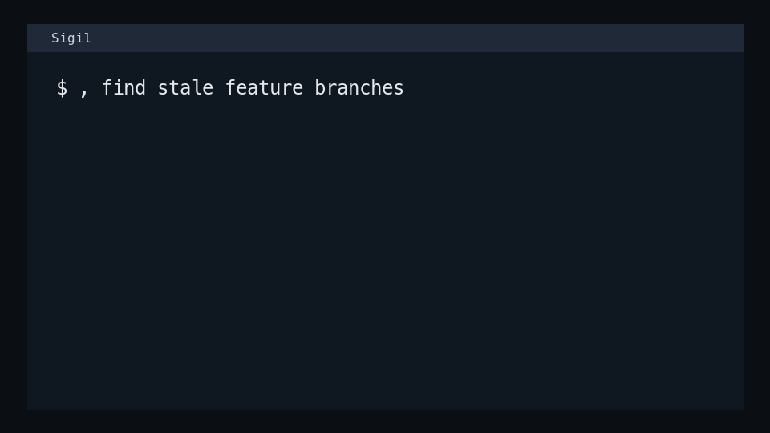

# Sigil

[](https://github.com/rlouf/sigil/actions/workflows/ci.yml)
[](https://pypi.org/project/sigil-sh/)
[](https://pypi.org/project/sigil-sh/)
[](LICENSE)

Natural-language shell assistant.

Sigil turns short terminal intents into explicit, inspectable shell actions.
Ask from local context, propose one command with an explicit verb, run one
command, or delegate one agent step without leaving your prompt.
Sigil is inspired by IRC-style bot commands: lightweight punctuation prefixes
that let you address an assistant inline without leaving the conversation.



```sh
, what changed in this repo?
,, run the relevant tests
,,, update the docs and run checks
+ cargo test
```

Sigil is alpha software. It is ready for early shell users who are comfortable
with local LLM tooling, explicit confirmations, and occasional interface
changes.

## Why Sigil?

Most shell assistants blur together three very different operations:
suggesting, executing, and explaining. Sigil keeps those routes separate.

| Need | Glyph | What happens |
| --- | --- | --- |
| "Answer from context." | `,` | Read-only answer with local inspection tools. No shell is exposed. |
| "Do one agent turn." | `,,` | Runs one Zeta invocation after confirmation. |
| "Do one routine turn." | `,,,` | Runs one Zeta invocation without per-step confirmation. |
| "Run and capture this command." | `+` | Runs one explicit command, streams output, and records stdout/stderr snippets. |

The result is a shell workflow with small blast radius, durable state, and a
plain CLI underneath the punctuation.

## Install

Install the Python command, then install the shell binding:

```sh
uv tool install sigil-sh
sigil install zsh
sigil doctor
```

For Bash:

```sh
uv tool install sigil-sh
sigil install bash
sigil doctor --shell bash
```

You can also install with `pipx`:

```sh
pipx install sigil-sh
```

To try the current main branch before a tagged release:

```sh
uv tool install git+https://github.com/rlouf/sigil
```

The Python package is named `sigil-sh` because `sigil` was not available as a
distribution name. The installed command is still `sigil`.

`sigil install` copies the bundled binding to `~/.sigil/shell/<shell>/` and
adds an idempotent source block to `.zshrc` or `.bashrc`. Running it again
updates the binding without duplicating the rc block.

## Requirements

- Python 3.11+
- zsh or Bash for shell bindings
- A local OpenAI-compatible chat completions endpoint for command generation
  and Zeta-backed answer/action routes (default
  `http://127.0.0.1:8080/v1/chat/completions`)
- The `zeta` entrypoint installed with Sigil. `sigil doctor` checks that both
  `sigil` and `zeta` are visible on PATH.
- `glow` for Markdown rendering, optional but recommended

Useful environment variables:

```sh
SIGIL_MODEL_URL=http://127.0.0.1:8080/v1/chat/completions
SIGIL_MODEL_NAME=local-model
SIGIL_MODEL_PATH=/path/to/model.gguf
SIGIL_STATE_DIR=$HOME/.sigil
SIGIL_RUN_CAPTURE_BYTES=6000
SIGIL_GLOW_STYLE=notty
SIGIL_GLOW_WIDTH=88
```

## Quick Start

Once the shell binding is installed, use the glyphs directly:

```sh
# Ask from read-only context.
, why did the last command fail?

# Propose one command through the explicit CLI verb.
sigil command "find wav files larger than 50 MB"

# Run one confirmed agent step.
,, run the relevant tests

# Run one command through Sigil's explicit capture path.
+ cargo test

```

Use stdin as context:

```sh
git diff | , review risky changes
git diff --name-only | , run the relevant tests
```

Read-only comma uses piped input directly because it has no execute path.
Agent-step comma routes preview piped input and ask before using it.

## A Typical Flow

```sh
# 1. Ask what changed.
, summarize this repo state

# 2. Ask for the smallest useful command.
sigil command "run the focused tests for this change"

# 3. Let Sigil run exactly one action.
,, run the focused tests

# 4. Audit what happened.
sigil events
```

Sigil stores command suggestions, answer turns, and act steps in an
inspectable event log so you can review the route each event came from.

## Glyph Reference

Installed zsh and Bash bindings expose these shortcuts:

| Glyph | Name | Behavior |
| --- | --- | --- |
| `,` | read | Answer from read-only context. |
| `,,` | step | Run one agent turn, confirming effects. |
| `,,,` | auto step | Run one agent turn, auto-approving routine effects. |
| `+` | run | Run one explicit command and capture stdout/stderr snippets. |

Examples:

```sh
, summarize this repo state
sigil command "find wav files"
,, run the relevant tests
,,, fix the failing parser test
+ cargo test
```

`,` prints a read-only answer. It does not stage commands or write to shell
history.

`,,` asks before handing the objective to Zeta, gives Zeta read/search/edit/write
tools, and returns control to the shell after one bounded Zeta invocation. At the
confirmation prompt, `e` opens `$VISUAL` or `$EDITOR` with the available tools,
one per line, so tools can be removed before execution. That invocation may
include zero or more tool calls. `,,,` runs the same one-turn route without
routine confirmation. Shell calls inside those turns go through Zeta's bash
handoff tool: Sigil prints the proposed command, asks whether to run or edit it,
streams stdout/stderr to the terminal, records the turn, and returns the
captured output plus exit status back to Zeta so the same turn can continue.
Agent steps always stream Zeta's raw tool calls and prose through `glow` or
`cat`; they do not replace the final answer with a compact summary.

Read-only routes do not expose Bash. If an answer recommends a command, it is
plain answer text, not a tool call or terminal handoff.

`+` runs the command you provide through `sigil run`, streams stdout/stderr live,
preserves the exit status, and records bounded stdout/stderr snippets for later
failure context. It does not use a shell parser; use `sh -c` for pipelines,
redirection, and shell-only syntax.

To install the CLI without punctuation shortcuts:

```sh
sigil install zsh --no-glyphs
```

## Route Model

Each route has a fixed effect on your system:

| Route | Effect | Rule |
| --- | --- | --- |
| `,` | read-only | Local answer route with no Bash tool. |
| `,,` | execute-write | One confirmed Zeta agent step. |
| `,,,` | execute-write | One auto-approved Zeta agent step. |
| `+` | execute | Explicit local command execution with stdout/stderr capture. |

Every route records what it did to the event log. Inspect it with:

```sh
sigil events
```

## CLI

The glyphs are thin shell functions over a regular CLI:

```text
sigil command [--json] [PROMPT]
sigil ask [--follow-up] [--json] [QUESTION]
sigil run COMMAND [ARGS...]
sigil act [show|resume|abort] [--json]
sigil events [--limit N] [--json] [--raw]
sigil session [show|path|list|clear] [--json]
sigil install {zsh|bash} [--install-dir DIR] [--rc FILE] [--glyphs|--no-glyphs]
sigil doctor [--shell auto|zsh|bash] [--json]
```

Copy-pasteable examples:

```sh
sigil command "find files over 10 MB in this repo excluding .git"
sigil command "show the largest directories"
git diff --name-only | sigil command "run the relevant tests"
sigil ask "what changed in this repo?"
sigil run cargo test
sigil act show
sigil events
```

See [docs/cli.md](docs/cli.md) for the user-facing CLI contract and JSON
examples.

## State

Sigil writes event-sourced state under `~/.sigil/` by default. Set
`SIGIL_STATE_DIR` to move it.

Installed Bash and zsh bindings set `SIGIL_SESSION_ID` once when the shell
starts, so separate terminal windows keep separate continuity. Override the
boundary with `SIGIL_SESSION_ID` or `SIGIL_SESSION_DIR`.

Inspect state without calling a model:

```sh
sigil session show
sigil session list
sigil session clear
sigil events
```

## Project Scope

Sigil is:

- A command-line tool and optional shell binding.
- A local-model command proposal route.
- Zeta-backed read-only answer and one-step edit routes.
- An evented state layer for shell continuity and audit history.

Sigil is not:

- A public Python library. The Python package does not expose a supported API.
- A background autonomous agent.
- A replacement for reviewing commands and model output.

## Roadmap

`sigil sh` is the likely next shell-shaped surface once explicit command
execution proves itself. The shell hooks are intentionally lightweight: they can
record command metadata, but they should not invisibly interpose on every
program's terminal output. A future shell frontend would own the prompt and
transcript boundary, delegate command semantics to the user's real shell, and
decide deliberately when a command runs as structured captured output versus an
interactive terminal session.

## Development

Set up the repo:

```sh
uv sync --group dev
```

Run the checks used by CI:

```sh
uv run pre-commit run --all-files
uv run pytest
```

Render deterministic demo GIFs:

```sh
scripts/render-demo-gifs.sh
```

Demo tapes live in [docs/demos](docs/demos/). They run the real Sigil CLI
from this checkout while shimming only external dependencies such as the
model server and `uv`.

## License

Apache-2.0. See [LICENSE](LICENSE).
