# Import graph of `src/sigil`

Internal import dependencies, extracted with `ast`. The graph is acyclic.

Topological order for review/modification: a change to a module in an
earlier layer can force changes in later layers, never the reverse.
"Ripple" is the number of modules that transitively depend on it.

## Topologically sorted list

### Layer 0

- `sigil.protocols` — ripple 41
- `sigil.state` — ripple 38
- `sigil.zeta.skills` — ripple 22
- `sigil.display.tty` — ripple 19
- `sigil._version` — ripple 13
- `sigil.cli._shared` — ripple 7
- `sigil.zeta.context` — ripple 6
- `sigil` — ripple 0
- `sigil.workflows` — ripple 0
- `sigil.zeta` — ripple 0

### Layer 1

- `sigil.zeta.tools.base` — ripple 30
- `sigil.zeta.trace` — ripple 29
- `sigil.zeta.models` — ripple 19
- `sigil.ledger` — ripple 16
- `sigil.cli._base` — ripple 12
- `sigil.failure` — ripple 11

### Layer 2

- `sigil.zeta.timeline` — ripple 23
- `sigil.zeta.tools.bash` — ripple 23
- `sigil.zeta.tools.edit` — ripple 23
- `sigil.zeta.tools.grep` — ripple 23
- `sigil.zeta.tools.ls` — ripple 23
- `sigil.zeta.tools.plugins` — ripple 23
- `sigil.zeta.tools.read` — ripple 23
- `sigil.zeta.tools.write` — ripple 23
- `sigil.zeta.model` — ripple 16
- `sigil.session` — ripple 10
- `sigil.cli` — ripple 0
- `sigil.cli.log` — ripple 0

### Layer 3

- `sigil.zeta.tools` — ripple 22
- `sigil.handoff` — ripple 2
- `sigil.install` — ripple 1
- `sigil.status` — ripple 1
- `sigil.cli.events` — ripple 0
- `sigil.cli.model` — ripple 0
- `sigil.cli.run` — ripple 0

### Layer 4

- `sigil.zeta.prompt.system` — ripple 21
- `sigil.cli.handoff` — ripple 0
- `sigil.cli.install` — ripple 0
- `sigil.cli.status` — ripple 0

### Layer 5

- `sigil.zeta.prompt.components` — ripple 20

### Layer 6

- `sigil.zeta.prompt.budget` — ripple 18
- `sigil.zeta.prompt.compaction.task_state` — ripple 11

### Layer 7

- `sigil.zeta.prompt.compaction.drop_oldest` — ripple 11
- `sigil.zeta.prompt.compaction.structural_trim` — ripple 11
- `sigil.zeta.prompt.transforms` — ripple 11
- `sigil.display.summarize` — ripple 10

### Layer 8

- `sigil.zeta.prompt.builder` — ripple 10
- `sigil.zeta.prompt.compaction` — ripple 10
- `sigil.display.render` — ripple 8

### Layer 9

- `sigil.zeta.prompt` — ripple 9
- `sigil.cli.session` — ripple 0

### Layer 10

- `sigil.zeta.agent` — ripple 7
- `sigil.cli.zeta` — ripple 0

### Layer 11

- `sigil.agent_io` — ripple 6

### Layer 12

- `sigil.workflows.step` — ripple 3
- `sigil.workflows.ask` — ripple 1

### Layer 13

- `sigil.workflows.do` — ripple 1
- `sigil.workflows.propose` — ripple 1
- `sigil.cli.ask` — ripple 0

### Layer 14

- `sigil.cli.zeta_step` — ripple 0

## Direct dependencies per module

Modules with no internal imports are omitted.

- `sigil.agent_io` imports `sigil.display.render`, `sigil.ledger`, `sigil.protocols`, `sigil.zeta.agent`, `sigil.zeta.model`, `sigil.zeta.models`, `sigil.zeta.timeline`, `sigil.zeta.trace`
- `sigil.cli` imports `sigil.cli._base`
- `sigil.cli._base` imports `sigil._version`
- `sigil.cli.ask` imports `sigil.cli._base`, `sigil.cli._shared`, `sigil.workflows.ask`
- `sigil.cli.events` imports `sigil.cli._base`, `sigil.cli._shared`, `sigil.session`
- `sigil.cli.handoff` imports `sigil.cli._base`, `sigil.cli._shared`, `sigil.handoff`
- `sigil.cli.install` imports `sigil.cli._base`, `sigil.cli._shared`, `sigil.install`
- `sigil.cli.log` imports `sigil.cli._base`, `sigil.ledger`
- `sigil.cli.model` imports `sigil.cli._base`, `sigil.zeta.model`, `sigil.zeta.models`
- `sigil.cli.run` imports `sigil.cli._base`, `sigil.session`
- `sigil.cli.session` imports `sigil.cli._base`, `sigil.cli._shared`, `sigil.display.render`, `sigil.session`, `sigil.zeta.timeline`
- `sigil.cli.status` imports `sigil.cli._base`, `sigil.cli._shared`, `sigil.status`
- `sigil.cli.zeta` imports `sigil.cli._base`, `sigil.cli._shared`, `sigil.display.summarize`, `sigil.zeta.prompt`, `sigil.zeta.trace`
- `sigil.cli.zeta_step` imports `sigil.cli._base`, `sigil.display.summarize`, `sigil.handoff`, `sigil.protocols`, `sigil.workflows.do`, `sigil.workflows.propose`
- `sigil.display.render` imports `sigil.display.summarize`, `sigil.display.tty`, `sigil.zeta.prompt.budget`
- `sigil.display.summarize` imports `sigil.protocols`, `sigil.zeta.prompt.budget`, `sigil.zeta.trace`
- `sigil.failure` imports `sigil.state`
- `sigil.handoff` imports `sigil.ledger`, `sigil.protocols`, `sigil.session`, `sigil.zeta.timeline`
- `sigil.install` imports `sigil.state`, `sigil.zeta.model`, `sigil.zeta.models`
- `sigil.ledger` imports `sigil.protocols`, `sigil.state`
- `sigil.session` imports `sigil.failure`, `sigil.ledger`, `sigil.protocols`, `sigil.state`, `sigil.zeta.trace`
- `sigil.status` imports `sigil.session`, `sigil.state`, `sigil.zeta.models`
- `sigil.workflows.ask` imports `sigil.agent_io`, `sigil.display.render`, `sigil.protocols`, `sigil.session`, `sigil.state`, `sigil.zeta.agent`, `sigil.zeta.context`, `sigil.zeta.model`, `sigil.zeta.models`, `sigil.zeta.skills`, `sigil.zeta.timeline`, `sigil.zeta.trace`
- `sigil.workflows.do` imports `sigil.workflows.step`
- `sigil.workflows.propose` imports `sigil.workflows.step`
- `sigil.workflows.step` imports `sigil.agent_io`, `sigil.display.render`, `sigil.display.summarize`, `sigil.protocols`, `sigil.zeta.agent`, `sigil.zeta.context`, `sigil.zeta.models`, `sigil.zeta.prompt`, `sigil.zeta.skills`, `sigil.zeta.timeline`, `sigil.zeta.tools`, `sigil.zeta.trace`
- `sigil.zeta.agent` imports `sigil.protocols`, `sigil.zeta.model`, `sigil.zeta.prompt`, `sigil.zeta.tools`, `sigil.zeta.trace`
- `sigil.zeta.model` imports `sigil.display.tty`, `sigil.zeta.models`
- `sigil.zeta.models` imports `sigil.state`
- `sigil.zeta.prompt` imports `sigil.zeta.prompt.budget`, `sigil.zeta.prompt.builder`, `sigil.zeta.prompt.compaction`, `sigil.zeta.prompt.components`, `sigil.zeta.prompt.system`, `sigil.zeta.prompt.transforms`
- `sigil.zeta.prompt.budget` imports `sigil.zeta.prompt.components`
- `sigil.zeta.prompt.builder` imports `sigil.zeta.model`, `sigil.zeta.prompt.components`, `sigil.zeta.prompt.system`, `sigil.zeta.prompt.transforms`, `sigil.zeta.skills`, `sigil.zeta.tools`, `sigil.zeta.trace`
- `sigil.zeta.prompt.compaction` imports `sigil.zeta.prompt.compaction.drop_oldest`, `sigil.zeta.prompt.compaction.structural_trim`, `sigil.zeta.prompt.compaction.task_state`
- `sigil.zeta.prompt.compaction.drop_oldest` imports `sigil.zeta.prompt.budget`, `sigil.zeta.prompt.components`
- `sigil.zeta.prompt.compaction.structural_trim` imports `sigil.zeta.prompt.budget`, `sigil.zeta.prompt.components`
- `sigil.zeta.prompt.compaction.task_state` imports `sigil.zeta.model`, `sigil.zeta.prompt.components`
- `sigil.zeta.prompt.components` imports `sigil.zeta.prompt.system`, `sigil.zeta.skills`, `sigil.zeta.timeline`, `sigil.zeta.tools`, `sigil.zeta.trace`
- `sigil.zeta.prompt.system` imports `sigil.protocols`, `sigil.zeta.skills`, `sigil.zeta.tools`
- `sigil.zeta.prompt.transforms` imports `sigil.zeta.prompt.budget`, `sigil.zeta.prompt.components`
- `sigil.zeta.timeline` imports `sigil.protocols`, `sigil.state`, `sigil.zeta.trace`
- `sigil.zeta.tools` imports `sigil.zeta.tools.base`, `sigil.zeta.tools.bash`, `sigil.zeta.tools.edit`, `sigil.zeta.tools.grep`, `sigil.zeta.tools.ls`, `sigil.zeta.tools.plugins`, `sigil.zeta.tools.read`, `sigil.zeta.tools.write`
- `sigil.zeta.tools.base` imports `sigil.protocols`
- `sigil.zeta.tools.bash` imports `sigil.zeta.tools.base`
- `sigil.zeta.tools.edit` imports `sigil.zeta.tools.base`
- `sigil.zeta.tools.grep` imports `sigil.zeta.tools.base`
- `sigil.zeta.tools.ls` imports `sigil.zeta.tools.base`
- `sigil.zeta.tools.plugins` imports `sigil.zeta.tools.base`
- `sigil.zeta.tools.read` imports `sigil.zeta.tools.base`
- `sigil.zeta.tools.write` imports `sigil.zeta.tools.base`
- `sigil.zeta.trace` imports `sigil.state`

## Graph

```mermaid
graph TD
    sigil["sigil"]
    sigil__version["_version"]
    sigil_agent_io["agent_io"]
    sigil_cli["cli"]
    sigil_cli__base["cli._base"]
    sigil_cli__shared["cli._shared"]
    sigil_cli_ask["cli.ask"]
    sigil_cli_events["cli.events"]
    sigil_cli_handoff["cli.handoff"]
    sigil_cli_install["cli.install"]
    sigil_cli_log["cli.log"]
    sigil_cli_model["cli.model"]
    sigil_cli_run["cli.run"]
    sigil_cli_session["cli.session"]
    sigil_cli_status["cli.status"]
    sigil_cli_zeta["cli.zeta"]
    sigil_cli_zeta_step["cli.zeta_step"]
    sigil_display_render["display.render"]
    sigil_display_summarize["display.summarize"]
    sigil_display_tty["display.tty"]
    sigil_failure["failure"]
    sigil_handoff["handoff"]
    sigil_install["install"]
    sigil_ledger["ledger"]
    sigil_protocols["protocols"]
    sigil_session["session"]
    sigil_state["state"]
    sigil_status["status"]
    sigil_workflows["workflows"]
    sigil_workflows_ask["workflows.ask"]
    sigil_workflows_do["workflows.do"]
    sigil_workflows_propose["workflows.propose"]
    sigil_workflows_step["workflows.step"]
    sigil_zeta["zeta"]
    sigil_zeta_agent["zeta.agent"]
    sigil_zeta_context["zeta.context"]
    sigil_zeta_model["zeta.model"]
    sigil_zeta_models["zeta.models"]
    sigil_zeta_prompt["zeta.prompt"]
    sigil_zeta_prompt_budget["zeta.prompt.budget"]
    sigil_zeta_prompt_builder["zeta.prompt.builder"]
    sigil_zeta_prompt_compaction["zeta.prompt.compaction"]
    sigil_zeta_prompt_compaction_drop_oldest["zeta.prompt.compaction.drop_oldest"]
    sigil_zeta_prompt_compaction_structural_trim["zeta.prompt.compaction.structural_trim"]
    sigil_zeta_prompt_compaction_task_state["zeta.prompt.compaction.task_state"]
    sigil_zeta_prompt_components["zeta.prompt.components"]
    sigil_zeta_prompt_system["zeta.prompt.system"]
    sigil_zeta_prompt_transforms["zeta.prompt.transforms"]
    sigil_zeta_skills["zeta.skills"]
    sigil_zeta_timeline["zeta.timeline"]
    sigil_zeta_tools["zeta.tools"]
    sigil_zeta_tools_base["zeta.tools.base"]
    sigil_zeta_tools_bash["zeta.tools.bash"]
    sigil_zeta_tools_edit["zeta.tools.edit"]
    sigil_zeta_tools_grep["zeta.tools.grep"]
    sigil_zeta_tools_ls["zeta.tools.ls"]
    sigil_zeta_tools_plugins["zeta.tools.plugins"]
    sigil_zeta_tools_read["zeta.tools.read"]
    sigil_zeta_tools_write["zeta.tools.write"]
    sigil_zeta_trace["zeta.trace"]
    sigil_display_render --> sigil_agent_io
    sigil_ledger --> sigil_agent_io
    sigil_protocols --> sigil_agent_io
    sigil_zeta_agent --> sigil_agent_io
    sigil_zeta_model --> sigil_agent_io
    sigil_zeta_models --> sigil_agent_io
    sigil_zeta_timeline --> sigil_agent_io
    sigil_zeta_trace --> sigil_agent_io
    sigil_cli__base --> sigil_cli
    sigil__version --> sigil_cli__base
    sigil_cli__base --> sigil_cli_ask
    sigil_cli__shared --> sigil_cli_ask
    sigil_workflows_ask --> sigil_cli_ask
    sigil_cli__base --> sigil_cli_events
    sigil_cli__shared --> sigil_cli_events
    sigil_session --> sigil_cli_events
    sigil_cli__base --> sigil_cli_handoff
    sigil_cli__shared --> sigil_cli_handoff
    sigil_handoff --> sigil_cli_handoff
    sigil_cli__base --> sigil_cli_install
    sigil_cli__shared --> sigil_cli_install
    sigil_install --> sigil_cli_install
    sigil_cli__base --> sigil_cli_log
    sigil_ledger --> sigil_cli_log
    sigil_cli__base --> sigil_cli_model
    sigil_zeta_model --> sigil_cli_model
    sigil_zeta_models --> sigil_cli_model
    sigil_cli__base --> sigil_cli_run
    sigil_session --> sigil_cli_run
    sigil_cli__base --> sigil_cli_session
    sigil_cli__shared --> sigil_cli_session
    sigil_display_render --> sigil_cli_session
    sigil_session --> sigil_cli_session
    sigil_zeta_timeline --> sigil_cli_session
    sigil_cli__base --> sigil_cli_status
    sigil_cli__shared --> sigil_cli_status
    sigil_status --> sigil_cli_status
    sigil_cli__base --> sigil_cli_zeta
    sigil_cli__shared --> sigil_cli_zeta
    sigil_display_summarize --> sigil_cli_zeta
    sigil_zeta_prompt --> sigil_cli_zeta
    sigil_zeta_trace --> sigil_cli_zeta
    sigil_cli__base --> sigil_cli_zeta_step
    sigil_display_summarize --> sigil_cli_zeta_step
    sigil_handoff --> sigil_cli_zeta_step
    sigil_protocols --> sigil_cli_zeta_step
    sigil_workflows_do --> sigil_cli_zeta_step
    sigil_workflows_propose --> sigil_cli_zeta_step
    sigil_display_summarize --> sigil_display_render
    sigil_display_tty --> sigil_display_render
    sigil_zeta_prompt_budget --> sigil_display_render
    sigil_protocols --> sigil_display_summarize
    sigil_zeta_prompt_budget --> sigil_display_summarize
    sigil_zeta_trace --> sigil_display_summarize
    sigil_state --> sigil_failure
    sigil_ledger --> sigil_handoff
    sigil_protocols --> sigil_handoff
    sigil_session --> sigil_handoff
    sigil_zeta_timeline --> sigil_handoff
    sigil_state --> sigil_install
    sigil_zeta_model --> sigil_install
    sigil_zeta_models --> sigil_install
    sigil_protocols --> sigil_ledger
    sigil_state --> sigil_ledger
    sigil_failure --> sigil_session
    sigil_ledger --> sigil_session
    sigil_protocols --> sigil_session
    sigil_state --> sigil_session
    sigil_zeta_trace --> sigil_session
    sigil_session --> sigil_status
    sigil_state --> sigil_status
    sigil_zeta_models --> sigil_status
    sigil_agent_io --> sigil_workflows_ask
    sigil_display_render --> sigil_workflows_ask
    sigil_protocols --> sigil_workflows_ask
    sigil_session --> sigil_workflows_ask
    sigil_state --> sigil_workflows_ask
    sigil_zeta_agent --> sigil_workflows_ask
    sigil_zeta_context --> sigil_workflows_ask
    sigil_zeta_model --> sigil_workflows_ask
    sigil_zeta_models --> sigil_workflows_ask
    sigil_zeta_skills --> sigil_workflows_ask
    sigil_zeta_timeline --> sigil_workflows_ask
    sigil_zeta_trace --> sigil_workflows_ask
    sigil_workflows_step --> sigil_workflows_do
    sigil_workflows_step --> sigil_workflows_propose
    sigil_agent_io --> sigil_workflows_step
    sigil_display_render --> sigil_workflows_step
    sigil_display_summarize --> sigil_workflows_step
    sigil_protocols --> sigil_workflows_step
    sigil_zeta_agent --> sigil_workflows_step
    sigil_zeta_context --> sigil_workflows_step
    sigil_zeta_models --> sigil_workflows_step
    sigil_zeta_prompt --> sigil_workflows_step
    sigil_zeta_skills --> sigil_workflows_step
    sigil_zeta_timeline --> sigil_workflows_step
    sigil_zeta_tools --> sigil_workflows_step
    sigil_zeta_trace --> sigil_workflows_step
    sigil_protocols --> sigil_zeta_agent
    sigil_zeta_model --> sigil_zeta_agent
    sigil_zeta_prompt --> sigil_zeta_agent
    sigil_zeta_tools --> sigil_zeta_agent
    sigil_zeta_trace --> sigil_zeta_agent
    sigil_display_tty --> sigil_zeta_model
    sigil_zeta_models --> sigil_zeta_model
    sigil_state --> sigil_zeta_models
    sigil_zeta_prompt_budget --> sigil_zeta_prompt
    sigil_zeta_prompt_builder --> sigil_zeta_prompt
    sigil_zeta_prompt_compaction --> sigil_zeta_prompt
    sigil_zeta_prompt_components --> sigil_zeta_prompt
    sigil_zeta_prompt_system --> sigil_zeta_prompt
    sigil_zeta_prompt_transforms --> sigil_zeta_prompt
    sigil_zeta_prompt_components --> sigil_zeta_prompt_budget
    sigil_zeta_model --> sigil_zeta_prompt_builder
    sigil_zeta_prompt_components --> sigil_zeta_prompt_builder
    sigil_zeta_prompt_system --> sigil_zeta_prompt_builder
    sigil_zeta_prompt_transforms --> sigil_zeta_prompt_builder
    sigil_zeta_skills --> sigil_zeta_prompt_builder
    sigil_zeta_tools --> sigil_zeta_prompt_builder
    sigil_zeta_trace --> sigil_zeta_prompt_builder
    sigil_zeta_prompt_compaction_drop_oldest --> sigil_zeta_prompt_compaction
    sigil_zeta_prompt_compaction_structural_trim --> sigil_zeta_prompt_compaction
    sigil_zeta_prompt_compaction_task_state --> sigil_zeta_prompt_compaction
    sigil_zeta_prompt_budget --> sigil_zeta_prompt_compaction_drop_oldest
    sigil_zeta_prompt_components --> sigil_zeta_prompt_compaction_drop_oldest
    sigil_zeta_prompt_budget --> sigil_zeta_prompt_compaction_structural_trim
    sigil_zeta_prompt_components --> sigil_zeta_prompt_compaction_structural_trim
    sigil_zeta_model --> sigil_zeta_prompt_compaction_task_state
    sigil_zeta_prompt_components --> sigil_zeta_prompt_compaction_task_state
    sigil_zeta_prompt_system --> sigil_zeta_prompt_components
    sigil_zeta_skills --> sigil_zeta_prompt_components
    sigil_zeta_timeline --> sigil_zeta_prompt_components
    sigil_zeta_tools --> sigil_zeta_prompt_components
    sigil_zeta_trace --> sigil_zeta_prompt_components
    sigil_protocols --> sigil_zeta_prompt_system
    sigil_zeta_skills --> sigil_zeta_prompt_system
    sigil_zeta_tools --> sigil_zeta_prompt_system
    sigil_zeta_prompt_budget --> sigil_zeta_prompt_transforms
    sigil_zeta_prompt_components --> sigil_zeta_prompt_transforms
    sigil_protocols --> sigil_zeta_timeline
    sigil_state --> sigil_zeta_timeline
    sigil_zeta_trace --> sigil_zeta_timeline
    sigil_zeta_tools_base --> sigil_zeta_tools
    sigil_zeta_tools_bash --> sigil_zeta_tools
    sigil_zeta_tools_edit --> sigil_zeta_tools
    sigil_zeta_tools_grep --> sigil_zeta_tools
    sigil_zeta_tools_ls --> sigil_zeta_tools
    sigil_zeta_tools_plugins --> sigil_zeta_tools
    sigil_zeta_tools_read --> sigil_zeta_tools
    sigil_zeta_tools_write --> sigil_zeta_tools
    sigil_protocols --> sigil_zeta_tools_base
    sigil_zeta_tools_base --> sigil_zeta_tools_bash
    sigil_zeta_tools_base --> sigil_zeta_tools_edit
    sigil_zeta_tools_base --> sigil_zeta_tools_grep
    sigil_zeta_tools_base --> sigil_zeta_tools_ls
    sigil_zeta_tools_base --> sigil_zeta_tools_plugins
    sigil_zeta_tools_base --> sigil_zeta_tools_read
    sigil_zeta_tools_base --> sigil_zeta_tools_write
    sigil_state --> sigil_zeta_trace
```

